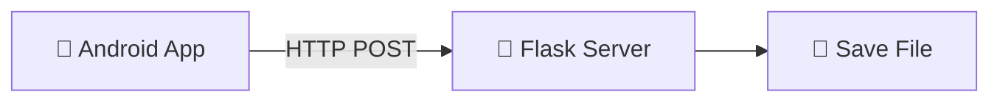

# 🚀 File Transfer App (Android ➜ Laptop)

<p align="center">
  📱➡️💻 <b>Seamless File Transfer over Local Network</b><br>
  <i>No cables • No internet • No third-party apps</i>
</p>

---

## ✨ Overview

This project is a **simple yet powerful file transfer system** that enables users to send files from an **Android device to a Laptop** using a **Flask server over a local network (WiFi/Hotspot)**.

> ⚡ Designed to eliminate the complexity of traditional file transfer methods.

---

## 🎬 Demo Preview

<p align="center">
  🔄 Select File → 📤 Upload → 💻 Saved on Laptop
</p>

---

## 🔥 Key Features

* 📂 Select any file from Android device
* 📡 Transfer files via WiFi / Hotspot
* 💾 Automatically saves files on laptop
* 🧾 Maintains original file names
* ⚡ Fast and lightweight
* 🔒 No internet required (local network only)

---

## 🧠 Problem Solved

> Transferring files between mobile and laptop is often slow and complicated (USB, email, cloud uploads).

💡 This app provides a **one-click simple solution** for fast local transfers.

---

## 🛠️ Tech Stack

| Technology        | Purpose        |
| ----------------- | -------------- |
| 📱 Android (Java) | Mobile App     |
| 🐍 Flask (Python) | Backend Server |
| 🌐 HTTP Protocol  | Communication  |
| 📡 WiFi/Hotspot   | Data Transfer  |

---

## 🏗️ Project Structure

```
FileTransferApp/
│
├── server.py              # Flask Backend
├── android_app/           # Android Studio Project
│
└── received_files/        # Saved Files
```

---

## ⚙️ How It Works



---

## ▶️ How to Run

### 1️⃣ Start Flask Server

```bash
python server.py
```

---

### 2️⃣ Connect Devices

* Connect both devices to:

  * Same WiFi OR
  * Mobile Hotspot

---

### 3️⃣ Run Android App

* Open the app
* Click **Select File and Upload**
* Choose file

---

### 4️⃣ Output

📁 File will be saved in:

```
received_files/
```

---


## 🚀 Future Enhancements

* 📊 Upload Progress Bar
* 📁 Multiple File Transfer
* 🔄 Bidirectional Transfer (Laptop ➜ Phone)
* 🎨 Improved UI/UX
* ☁️ Cloud Integration

---

## 🧩 Key Learnings

* Client-Server Architecture
* Android Networking
* HTTP File Upload (Multipart)
* Flask Backend Development
* Real-world Problem Solving

---

## 💡 Use Cases

* Quick file sharing between devices
* Offline file transfer
* Alternative to apps like SHAREit

---

## 👨‍💻 Author

**Charan Kumar Reddy**

---

## ⭐ Support

If you like this project:

👉 Star ⭐ the repository
👉 Share with others
👉 Improve and build upon it

---

<p align="center">
  🚀 Built with passion and learning mindset
</p>
